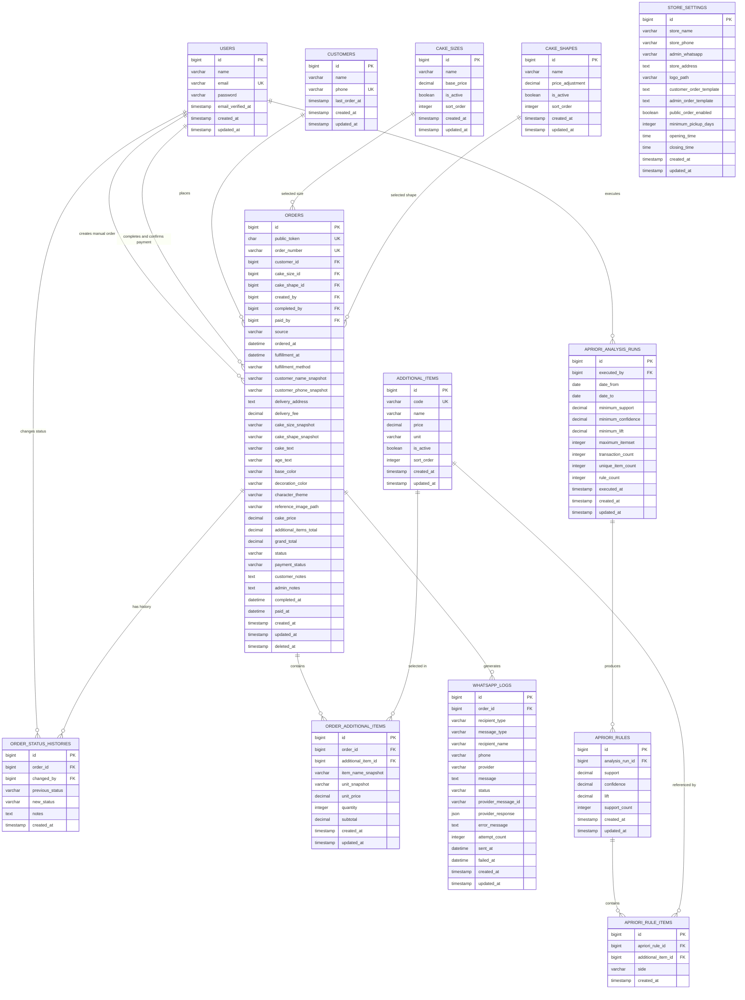

# ERD Sistem Pemesanan Kue dan Analisis Apriori

## 1. Diagram Relasi



---

# 2. Relasi Utama

## Customer dan Order

```text
customers 1 ───── N orders
```

Satu pelanggan dapat membuat banyak pesanan.

Pelanggan tidak memiliki akun login. Data pelanggan dikenali menggunakan nomor WhatsApp yang sudah dinormalisasi.

Contoh:

```text
Input  : 081234567890
Simpan : 6281234567890
```

Data nama dan nomor pelanggan juga disimpan sebagai snapshot di tabel `orders`. Tujuannya agar invoice lama tidak ikut berubah jika data master pelanggan diperbarui.

---

## Order dan Item Tambahan

```text
orders 1 ───── N order_additional_items
additional_items 1 ───── N order_additional_items
```

Satu order dapat memiliki banyak item tambahan.

Contoh:

```text
ORD-001
├── Pisau × 1
├── Lilin × 2
└── Piring × 10
```

Tabel `order_additional_items` menjadi sumber utama dataset Apriori.

Constraint yang disarankan:

```text
UNIQUE(order_id, additional_item_id)
```

Constraint tersebut mencegah item yang sama dimasukkan dua kali dalam satu order.

---

## Order dan WhatsApp Log

```text
orders 1 ───── N whatsapp_logs
```

Satu order dapat menghasilkan beberapa log WhatsApp:

```text
ORD-001
├── Notifikasi pelanggan
├── Notifikasi admin
├── Kirim ulang ke pelanggan
└── Kirim ulang ke admin
```

Status WhatsApp disimpan per penerima, bukan langsung di tabel `orders`.

---

## Order dan Riwayat Status

```text
orders 1 ───── N order_status_histories
```

Saat admin menekan tombol Done:

```text
previous_status = pending
new_status      = completed
changed_by      = ID admin
```

Tabel ini berguna untuk audit dan pelacakan perubahan.

---

# 3. Tabel `orders`

Tabel ini merupakan pusat sistem.

## Identitas order

| Kolom          | Fungsi                                  |
| -------------- | --------------------------------------- |
| `public_token` | Token aman untuk membuka invoice publik |
| `order_number` | Nomor order yang mudah dibaca           |
| `source`       | Sumber order: public atau admin         |
| `customer_id`  | Relasi ke pelanggan                     |

Contoh nomor order:

```text
ORD-202606-0001
```

Contoh token invoice:

```text
01JYEXMRH8SHQKPY15BC2HGN46
```

URL invoice:

```text
/invoice/01JYEXMRH8SHQKPY15BC2HGN46
```

Jangan menggunakan URL seperti:

```text
/invoice/1
/invoice/2
```

---

## Jadwal pesanan

Gunakan satu kolom datetime:

```text
fulfillment_at
```

Lebih baik daripada memisahkan tanggal dan jam penerimaan, karena:

- Filtering lebih sederhana.
- Sorting lebih sederhana.
- Validasi lebih mudah.
- Query pesanan hari ini lebih bersih.

Contoh query:

```sql
WHERE fulfillment_at BETWEEN '2026-06-22 00:00:00'
                    AND '2026-06-22 23:59:59'
```

---

## Harga

Gunakan tipe:

```text
DECIMAL(12,2)
```

Untuk:

- `cake_price`
- `delivery_fee`
- `additional_items_total`
- `grand_total`
- `unit_price`
- `subtotal`

Jangan gunakan `FLOAT` atau `DOUBLE` untuk nominal uang.

Rumus:

```text
additional_items_total =
SUM(order_additional_items.subtotal)

grand_total =
cake_price + additional_items_total + delivery_fee
```

Perhitungan final harus dilakukan di backend.

---

# 4. Snapshot Data

Snapshot diperlukan agar invoice lama tidak berubah ketika master data diperbarui.

Contoh master item:

```text
Nama lama  : Pisau Kue
Harga lama : Rp2.000
```

Kemudian admin mengubahnya menjadi:

```text
Nama baru  : Pisau Plastik
Harga baru : Rp3.000
```

Order lama tetap menyimpan:

```text
item_name_snapshot = Pisau Kue
unit_price         = 2000
```

Snapshot yang disimpan:

## Pada tabel orders

- Nama pelanggan.
- Nomor WhatsApp.
- Ukuran kue.
- Bentuk kue.
- Rasa dasar.
- Rasa isian.
- Harga final kue.

## Pada detail item

- Nama item.
- Satuan.
- Harga satuan.
- Quantity.
- Subtotal.

---

# 5. Master Data

## Cake Sizes

Contoh:

| Nama  | Harga dasar |
| ----- | ----------: |
| 20 cm |   Rp150.000 |
| 22 cm |   Rp180.000 |
| 25 cm |   Rp220.000 |
| 30 cm |   Rp300.000 |

## Cake Shapes

Contoh:

| Nama   | Penyesuaian harga |
| ------ | ----------------: |
| Bulat  |               Rp0 |
| Kotak  |          Rp10.000 |
| Hati   |          Rp15.000 |
| Custom |          Rp25.000 |

## Cake Flavors

Kolom `type` memiliki nilai:

```text
base
filling
```

Contoh:

| Nama            | Type    | Penyesuaian harga |
| --------------- | ------- | ----------------: |
| Cokelat         | base    |               Rp0 |
| Vanilla         | base    |               Rp0 |
| Red Velvet      | base    |          Rp20.000 |
| Cokelat Ganache | filling |          Rp15.000 |
| Keju            | filling |          Rp20.000 |

## Additional Items

Contoh:

| Nama   |    Harga | Satuan |
| ------ | -------: | ------ |
| Pisau  |  Rp2.000 | pcs    |
| Lilin  |  Rp1.000 | pcs    |
| Piring |    Rp500 | pcs    |
| Balon  |  Rp3.000 | pcs    |
| Topper | Rp10.000 | pcs    |

Master data sebaiknya tidak dihapus permanen. Gunakan:

```text
is_active = false
```

Item nonaktif tidak tampil di form publik, tetapi relasi transaksi lama tetap aman.

---

# 6. Status dan Nilai Enum

Gunakan PHP backed enum dan simpan sebagai `VARCHAR`, bukan MySQL native enum.

## OrderStatus

```php
enum OrderStatus: string
{
    case Pending = 'pending';
    case Completed = 'completed';
    case Cancelled = 'cancelled';
}
```

## OrderSource

```php
enum OrderSource: string
{
    case Public = 'public';
    case Admin = 'admin';
}
```

## FulfillmentMethod

```php
enum FulfillmentMethod: string
{
    case Pickup = 'pickup';
    case Delivery = 'delivery'; // Delivery / COD, dibayar saat serah terima
}
```

## WhatsAppStatus

```php
enum WhatsAppStatus: string
{
    case Pending = 'pending';
    case Sent = 'sent';
    case Failed = 'failed';
}
```

## WhatsAppRecipientType

```php
enum WhatsAppRecipientType: string
{
    case Customer = 'customer';
    case Admin = 'admin';
}
```

## AprioriRuleSide

```php
enum AprioriRuleSide: string
{
    case Antecedent = 'antecedent';
    case Consequent = 'consequent';
}
```

---

# 7. Struktur Apriori

Dataset tidak memerlukan tabel transaksi Apriori tambahan.

Sumber transaksi langsung dari:

```text
orders
order_additional_items
additional_items
```

Filter transaksi:

```text
orders.status = completed
orders.deleted_at IS NULL
fulfillment_at berada dalam periode analisis
```

Contoh basket:

```text
ORD-001 = [Pisau, Lilin, Piring]
ORD-002 = [Pisau, Piring]
ORD-003 = [Lilin, Balon]
ORD-004 = [Pisau, Lilin]
```

Quantity tidak menggandakan kemunculan item.

```text
Piring × 20
```

Tetap dianggap:

```text
Piring = terdapat dalam transaksi
```

---

# 8. Penyimpanan Hasil Apriori

## Apriori Analysis Runs

Menyimpan parameter setiap analisis:

```text
date_from
date_to
minimum_support
minimum_confidence
minimum_lift
maximum_itemset
transaction_count
rule_count
```

Ini berguna agar hasil analisis dapat direproduksi.

## Apriori Rules

Contoh rule:

```text
Pisau → Lilin
```

Nilai:

```text
support    = 0.400000
confidence = 0.666667
lift       = 1.333333
```

## Apriori Rule Items

Rule tidak disimpan dalam satu string atau JSON.

Contoh:

```text
apriori_rules
ID: 10

apriori_rule_items
├── rule_id: 10, item: Pisau, side: antecedent
└── rule_id: 10, item: Lilin, side: consequent
```

Untuk rule:

```text
Pisau + Piring → Lilin
```

Data:

```text
Pisau  = antecedent
Piring = antecedent
Lilin  = consequent
```

Struktur ini lebih mudah difilter dan lebih aman daripada menyimpan:

```json
{
    "antecedent": ["Pisau", "Piring"],
    "consequent": ["Lilin"]
}
```

---

# 9. Index Database

## Orders

```text
UNIQUE(public_token)
UNIQUE(order_number)
INDEX(customer_id)
INDEX(ordered_at)
INDEX(fulfillment_at)
INDEX(status)
INDEX(status, fulfillment_at)
INDEX(source)
```

Composite index penting:

```text
INDEX(status, fulfillment_at)
```

Digunakan untuk query:

```text
Pesanan belum selesai yang harus diambil hari ini.
```

## Customers

```text
UNIQUE(phone)
INDEX(name)
```

## Order Additional Items

```text
INDEX(order_id)
INDEX(additional_item_id)
UNIQUE(order_id, additional_item_id)
```

## WhatsApp Logs

```text
INDEX(order_id)
INDEX(status)
INDEX(recipient_type)
INDEX(order_id, recipient_type)
```

## Apriori

```text
INDEX(analysis_run_id)
INDEX(apriori_rule_id)
INDEX(additional_item_id)
```

---

# 10. Foreign Key Rules

Rekomendasi foreign key:

## Detail order

```text
order_additional_items.order_id
ON DELETE CASCADE
```

Jika order dihapus permanen pada maintenance khusus, detailnya ikut dihapus. Namun operasional normal tetap menggunakan soft delete.

## Master item

```text
order_additional_items.additional_item_id
ON DELETE RESTRICT
```

Master item yang sudah digunakan tidak boleh dihapus permanen.

## WhatsApp log

```text
whatsapp_logs.order_id
ON DELETE CASCADE
```

## Completed by

```text
orders.completed_by
ON DELETE SET NULL
```

Jika akun admin dihapus, histori waktu selesai tetap tersedia.

## Customer

```text
orders.customer_id
ON DELETE RESTRICT
```

Customer yang memiliki transaksi tidak boleh dihapus permanen.

---

# 11. Model Laravel dan Relasinya

## User

```php
public function createdOrders(): HasMany
{
    return $this->hasMany(Order::class, 'created_by');
}

public function completedOrders(): HasMany
{
    return $this->hasMany(Order::class, 'completed_by');
}
```

## Customer

```php
public function orders(): HasMany
{
    return $this->hasMany(Order::class);
}
```

## Order

```php
public function customer(): BelongsTo
{
    return $this->belongsTo(Customer::class);
}

public function additionalItems(): HasMany
{
    return $this->hasMany(OrderAdditionalItem::class);
}

public function whatsappLogs(): HasMany
{
    return $this->hasMany(WhatsAppLog::class);
}

public function statusHistories(): HasMany
{
    return $this->hasMany(OrderStatusHistory::class);
}

public function completedBy(): BelongsTo
{
    return $this->belongsTo(User::class, 'completed_by');
}
```

## AdditionalItem

```php
public function orderItems(): HasMany
{
    return $this->hasMany(OrderAdditionalItem::class);
}
```

## AprioriAnalysisRun

```php
public function rules(): HasMany
{
    return $this->hasMany(AprioriRule::class, 'analysis_run_id');
}
```

## AprioriRule

```php
public function items(): HasMany
{
    return $this->hasMany(AprioriRuleItem::class);
}
```

---

# 12. Urutan Migration

Urutan migration yang aman:

```text
1. users
2. customers
3. cake_sizes
4. cake_shapes
5. cake_flavors
6. additional_items
7. store_settings
8. orders
9. order_additional_items
10. whatsapp_logs
11. order_status_histories
12. apriori_analysis_runs
13. apriori_rules
14. apriori_rule_items
```

---

# 13. Catatan Arsitektur

## Tidak perlu tabel invoices

Invoice hanya merupakan tampilan dari:

```text
orders
customers
order_additional_items
store_settings
```

Tabel `invoices` baru diperlukan jika nantinya ada:

- Nomor invoice berbeda dari nomor order.
- Status pembayaran.
- Invoice revision.
- Pajak.
- Jatuh tempo.
- Cicilan.
- Refund.
- Banyak invoice untuk satu order.

Untuk scope saat ini, tabel invoice hanya menambah duplikasi.

## Tidak perlu tabel reports

Dashboard dan laporan dihasilkan dari query agregasi terhadap tabel transaksi.

## Tidak perlu tabel Apriori transaction

Basket transaksi dibangun langsung dari order selesai dan item tambahan.

## Token provider WhatsApp

API token WhatsApp jangan disimpan dalam tabel `store_settings`.

Simpan di `.env`:

```env
WHATSAPP_API_URL=
WHATSAPP_API_TOKEN=
WHATSAPP_PROVIDER=
```

Database hanya menyimpan:

- Nomor admin.
- Template pesan.
- Informasi toko.
